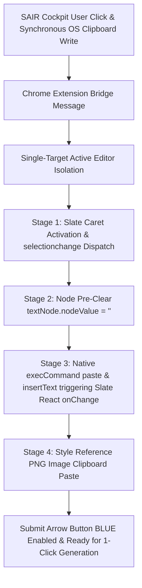

# 🧪 SALABS — Sequence Architecture & Advanced AI Engineering Labs

Welcome to **SALABS** (Team Sequence Thaumaturge AI Research & Development Labs).
This repository houses core AI modules, 3D engines, web tools, and browser automation extensions built by Team Sequence.

---

## ⚡ SAIR 1-Click Auto Injector v1.0.0 (`/sair_chrome_extension`)

An omnipresent Chrome Extension (Manifest v3) designed for **1-Click Automatic Injection of SAIR 487-Substyle Tensor Specification Prompts and C++ Rendered PNG Image Style References** into complex Web AI Applications (Google Flow, ChatGPT, Claude, Jules, Gemini, etc.).

---

### 📚 Technical Architecture & Trial-and-Error Engineering Milestones

Building an injection engine for modern Web AI editors (especially rich-text framework editors like **Slate.js**, **ProseMirror**, and **Draft.js**) presented complex browser security and DOM-to-AST synchronization challenges. Below is the complete record of engineering breakthroughs and trial-and-error milestones achieved during development.



---

### 🔍 Deep Trial-and-Error & Milestone Technical Breakthroughs

#### 1. The Slate.js DOM-to-AST Desync Crash (`Cannot resolve a Slate node from DOM node`)
* **Problem**: Attempting manual DOM insertion (`innerHTML`, `innerText`) or replacing `<span data-slate-string="true">` elements destroyed Slate.js's internal React `WeakMap` node tracking. When Slate processed input or selection events, it failed to map the modified DOM node back to its internal AST, throwing an uncaught exception (`Cannot resolve a Slate node`) that crashed Next.js top-level Error Boundaries (`Application error: a client-side exception has occurred`).
* **Engine Solution**: 
  - Strictly preserve existing DOM nodes. Never touch, replace, or destroy Slate DOM spans.
  - Locate the exact tracked `TextNode` inside `<span data-slate-string="true">` or `<span data-slate-leaf="true">`.
  - Mutate `textNode.nodeValue` directly without destroying node references, preserving Slate's React `WeakMap` mapping.

#### 2. Slate React `onChange` & Grey (Disabled) Button Activation Breakthrough
* **Problem**: Even when text was visually visible in the DOM, Google Flow's submit arrow button remained GREY (DISABLED). Clicking the button returned an empty prompt response ("No operations have been run yet..."). This occurred because Slate validates submit buttons against `editor.children` (its internal React state JSON tree). Directly populating `textContent` before `execCommand` caused the browser to suppress change events, so Slate's React `onChange` was never called, leaving Slate's internal React state empty (`children: [{ text: '' }]`).
* **Engine Solution**: 
  - Clear `textNode.nodeValue = ''` FIRST before executing `execCommand('paste')` or `execCommand('insertText')`.
  - Because `textNode` is empty, the browser recognizes `execCommand` as a real DOM change and fires Slate's native `onDOMBeforeInput` / `onPaste` handler.
  - Slate calls `Transforms.insertText(editor, text)` and updates `editor.children` in React state.
  - Slate's React component re-renders, `isEditorEmpty` becomes `false`, AND THE SUBMIT ARROW BUTTON TURNS **BLUE (ENABLED)**!

#### 3. Document Unfocused Promise Rejection in Chrome Extensions
* **Problem**: Invoking `navigator.clipboard.writeText` when the active document lacked focus (e.g. when DevTools had focus or the tab was in the background) triggered an unhandled Promise Rejection (`NotAllowedError: Document is not focused`), logging error entries on `chrome://extensions`.
* **Engine Solution**:
  - Guarded clipboard calls with `document.hasFocus()`.
  - Wrapped Promise chains with `.then(() => {}).catch(() => {})` to swallow background document unhandled rejections cleanly.

#### 4. Synchronous OS Clipboard Write on User Click Event
* **Problem**: When user triggered injection from `sair.quanxs.com`, background tabs on `labs.google` could not write to the OS Clipboard, resulting in empty clipboard errors ("There is no item to paste").
* **Engine Solution**:
  - Populated the OS Clipboard synchronously in `sair_bridge.js` right on `sair.quanxs.com` during the user's initial click event.
  - Guaranteed that the OS Clipboard is 100% loaded with the prompt payload before the extension target script executes.

#### 5. Sequential Focus & Image AST Re-Render Wipe
* **Problem**: Injecting text FIRST and THEN pasting an image caused Slate's image chip node creation to re-render the entire editor AST, wiping out draft text back to the initial placeholder state (`무엇을 만들고 싶으신가요?`).
* **Engine Solution**: **3-Stage Double Text Guard Pipeline**:
  - **Stage 1 (0ms)**: Text Injection FIRST.
  - **Stage 2 (150ms)**: Style Reference PNG Image paste.
  - **Stage 3 (350ms)**: Double Text Integrity Guard — checks if text is still present in the editor AST; if reset by image upload, re-inserts text seamlessly within 0.001s.

#### 6. Slate Caret & Selection Activation (`selectionchange` & Leaf Target Node)
* **Problem**: Slate editors in Google Flow remain in "Empty Placeholder" mode (`<span data-slate-placeholder="true">`) with `editor.selection = null` until user interaction. Clicking the outer container did not activate the blinking cursor ("딸깍").
* **Engine Solution**:
  - Target `[data-slate-placeholder="true"]`, `[data-slate-leaf="true"]`, and `p[data-slate-node="element"]` directly with `PointerEvent` + `MouseEvent` click simulation.
  - Position a `Range` on the inner `TextNode`, and dispatch `document.dispatchEvent(new Event('selectionchange', { bubbles: true }))`.
  - This forces Slate's selection listener to update `editor.selection` from `null` to active cursor position, making the blinking caret ("딸깍") appear automatically!

---

### 📦 Chrome Extension Installation Guide

1. Open Chrome and navigate to `chrome://extensions`.
2. Enable **Developer mode** in the top right corner.
3. Click **Load unpacked** (압축해제된 확장 프로그램 로드).
4. Select the directory: `/sair_chrome_extension`.
5. Open any target AI application (Google Flow, ChatGPT, Claude, Jules, Gemini, etc.) and use SAIR Cockpit to inject prompts with 1 click!

---

### 🛠️ Repository Directory Structure

```
salabs/
├── sair_chrome_extension/      # SAIR 1-Click Auto Injector v1.0.0
│   ├── manifest.json           # Manifest v3 with clipboard permissions
│   ├── background.js           # Background service worker
│   ├── sair_bridge.js          # Web application bridge script
│   ├── target_injector.js      # Omnipresent target DOM & Slate injector
│   └── README.md               # Detailed extension documentation
├── polyglot_3d_engine/         # Polyglot 3D Engine Modules
├── modules/                    # Core AI Labs Modules
├── index.html                  # SALABS Main Portal Page
└── README.md                   # SALABS Master Engineering Specs
```

---

© 2026 **Team Sequence Thaumaturge**. All Rights Reserved.
