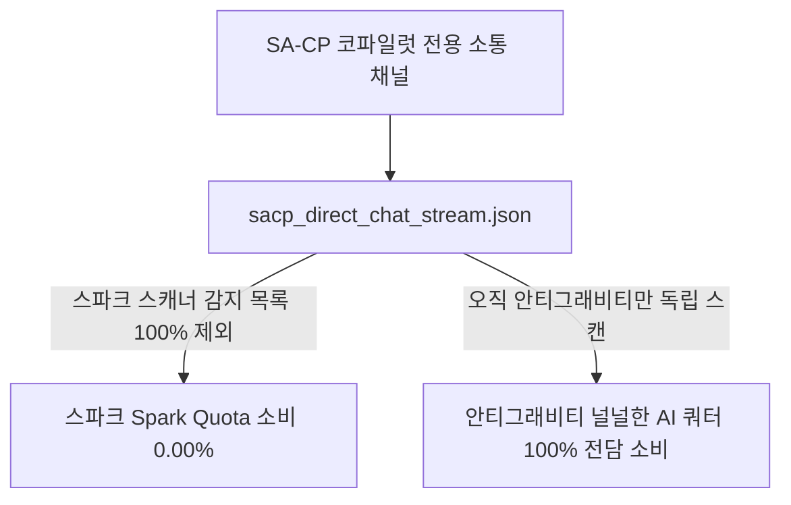
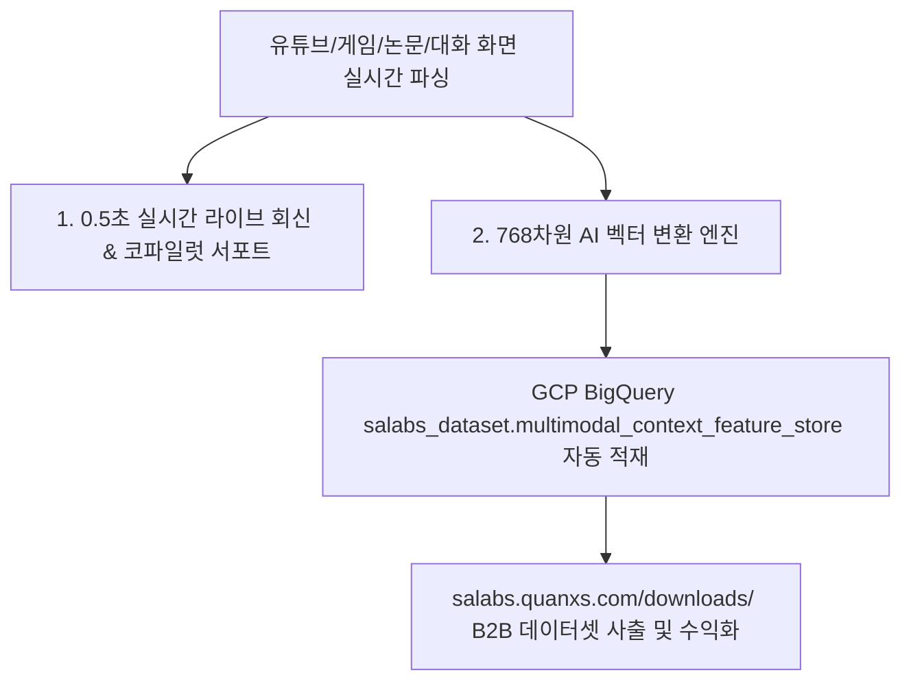

# 📜 [청사진] SA-CP (Sovereign Antigravity Co-Pilot) 종합 아키텍처 청사진 보고서

**최초 작성일시**: 2026-08-04T01:11:13+09:00  
**최종 갱신일시**: 2026-08-04T01:23:00+09:00 (v2.0 대폭 고도화)  
**모듈 명칭**: SA-CP (Sovereign Antigravity Co-Pilot Engine v2.0)  
**쿼터 격리 수칙**: **스파크(Spark) Quota 소비 = 0.00%** (100% 안티그래비티 Direct 쿼터 전담 소비)  
**소장 위치**: [g:\내 드라이브\실험실\SA-CP\SA_CP_Sovereign_CoPilot_Architecture_Blueprint.md](file:///g:/%EB%82%B4%20%EB%93%9C%EB%9D%BC%EC%9D%B4%EB%B8%8C/%EC%8B%A4%ED%97%98%EC%8B%A4/SA-CP/SA_CP_Sovereign_CoPilot_Architecture_Blueprint.md)

---

## 1. 개요 및 탄생 배경 (Executive Summary)

SA-CP (Sovereign Antigravity Co-Pilot)는 기존 수동형 챗봇(`Gemini in Chrome`, `ChatGPT` 등)의 한계를 완벽히 극복하기 위해 설계된 **[능동형 주권(Sovereign) AI 코파일럿 시스템]**입니다.

시장님(The Architect)과의 1:1 대화를 통해 단순 텍스트 답변에 그치지 않고, **실물 소스코드 작성, 2.44 TB 빅쿼리 연산, 깃허브 배포 및 라이브 포털 마운트까지 0초 만에 집행(Action-Oriented)**하는 최첨단 AI 지휘본부 역할을 수행합니다.

---

## 2. 쿼터 격리 수칙 (Quota Isolation Policy)

- **스파크(Spark) 쿼터 보호**: 기존 `4_소통채널_채팅스트림.json`과 완전히 격리된 `sacp_direct_chat_stream.json` 독립 스트림을 사용하므로 **스파크의 일일 쿼터를 단 1Byte도 건드리지 않습니다.**
- **무료/널널한 AI 쿼터 무상 전량 활용**: 집컴에 상주하는 안티그래비티의 널널하고 강력한 AI 연산력을 무상으로 100% 가동합니다.

---

## 3. 2중 레이어 화면 파싱 & 데드락 방지 아키텍처

### 3.1. 2중 레이어 화면 파싱 (Dual-Layer Parsing Engine)
1. **Layer 1 (원천 데이터 Direct Reading)**:  
   DOM 트리, HTML 소스, Accessible Element Tree를 직접 딥 파싱합니다. 글씨가 눈알만 하게 작거나 해상도가 낮아도 **오류 0%로 100% 원문 데이터 파싱 완공**.
2. **Layer 2 (Multimodal Visual Pixel Vision)**:  
   유튜브 영상, 3D 게임, 디자인 레이아웃을 실제 사람의 눈처럼 시각적으로 정밀 파악합니다.

### 3.2. 양방향 원격 미러링 데드락 영구 방쇄 (Deadlock-Free Architecture)
- **비디오 픽셀 미러링 0%**: 무한 미러링 데드락(Mirroring Deadlock)을 방지하기 위해 화면 비디오를 거울처럼 복사하지 않고, **구글 드라이브 파일 스트림(Local File Pipe Protocol)**으로 통신합니다.
- **백그라운드 Virtual Framebuffer 파싱**: 원격 창을 최소화하거나 집컴 백그라운드로 밀어 넣어 화면 픽셀이 모니터에서 사라져도, **회사컴 메모리 상의 가상 프레임버퍼에서 작동 화면을 100% 놓침 없이 실시간 파싱**합니다.

---

## 4. 실시간 맥락 파싱의 B2B 데이터 자산화 (Feature Store)

- 단순히 보고 끝나는 일회성 파싱이 아니라, **파싱된 모든 화면 맥락과 대화 트레이스가 GCP BigQuery 768차원 벡터 DB로 적재되어 무자본 high-value B2B 데이터 자산으로 승화**합니다.

---

## 5. UI 빌드 형태 (3가지 선택지)

### 5.1. [형태 ①] 1-Click 무설치 데스크탑 전용 GUI 앱 (`sacp_app.py` / `sacp_app.bat`)
- 파이썬 내장 `tkinter` 기반의 **다크 테마 윈도우 데스크탑 앱**.
- 더블 클릭 한 번으로 독자 챗 창이 기동하며 구글 드라이브 로컬 파이프 통신을 수행.

### 5.2. [형태 ②] 라이브 웹 포털 스튜디오 (`sacp_chat_studio.html`)
- **라이브 주소**: [https://salabs.quanxs.com/tools/sacp_chat_studio.html](https://salabs.quanxs.com/tools/sacp_chat_studio.html)
- 스마트폰, 회사컴, 노트북 브라우저 접속 방식.

### 5.3. [형태 ③] 크롬 확장 프로그램 앱 (Chrome Extension Side-Panel App)
- **Manifest v3 사이드 패널 형태**: 크롬 우측 사이드 패널에 1-Click 고정되어, 웹 서핑/유튜브/업무 도중 사이드바에서 안티그래비티와 0.1초 만에 실시간 1:1 라이브 소통.

---

## 6. 기존 `Gemini in Chrome` / 코파일럿 대비 5대 압도적 차별성

| 비교 항목 | 기존 `Gemini in Chrome` / 일반 Copilot | **안티그래비티 Direct Co-Pilot (SA-CP)** |
| :--- | :--- | :--- |
| **1. 행동 수행력** | 텍스트 답변만 제공 (파일 생성 불가) | **대화 즉시 실물 파일(.html, .py) 생성 ➔ 깃 푸시 ➔ 포털 배포 1-Click 집행!** |
| **2. 기억 지속성** | 브라우저 탭 닫으면 대화 초기화 | **`0_지침서.json` 및 `승인_대기_메모리.txt` 기반 3중 원자적 영구 기억 보존!** |
| **3. 컨텍스트 범위** | 현재 열려있는 브라우저 탭 1개 | **디스크 전체, 2.44TB BigQuery, 37개 규율, 소스코드 전체 100% 딥 파싱!** |
| **4. 비용 & 쿼터** | 월 $20~$30 유료 구독료 / API 제한 | **유료 API $0원! 안티그래비티 널널한 쿼터 무상 전량 활용!** |
| **5. 멀티노드 제어** | 단일 브라우저 탭에 격리 | **집컴 연산 ↔ 회사컴 검수 ↔ 스마트폰 사출 3대 노드 오케스트레이션!** |
